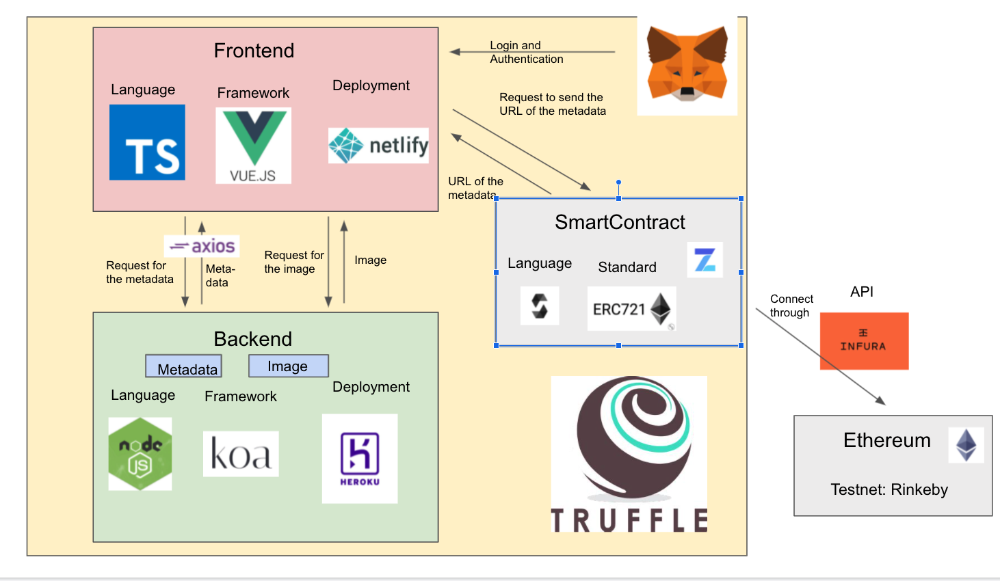

# Technology

The Frontend is our WebApp. Here we log in with our MetaMask Wallet. Form here we send a request to the smartContract to get the url of the metadata of the NFT as the metadata is to big to be stored in the SmartContract. 
Then we send this URL to the Backend to get the metadata of the Token. This is saved in a json file. In this metadata we also have the url of the image of the NFT stored. That we want to store on the same Server as ou Metadata. 

Backend: serves metadata and the images

1. create a [truffel](https://www.trufflesuite.com/truffle) Project - most popular development framework for Ethereum

2. most data lies in the `server.js` and the `router.js` file.
3. We use node.js and [Koa](https://koajs.com) as a framework. 

4. Tokens are in the `tokens.json` file

         fileStructure:
            {
               "0": {
                  "name": "Ainhoas Ocopus",
                  "desription": "It will grow and be beautiful and colorful",
                  "image": ""
               }
            }

5. deploy on Heroku - Service to deploy your BE:
   - create an account
   - install CLI

SmartContract:

1. Standard ERC721
2. Library for SmartContracts for NFTs [`@openzeppelin`](https://openzeppelin.com)
3. deploy on `Rinkeby Testnet` 
   - import `hdwallet-provider`
   - add a mnemonic - the twelve word phrase the wallet uses to generate public/private key pairs (MUST be in `.gitignore` file, so it doesn't become public)
   - create a project on [infura](https://infura.io) - framework to connect to blockchain - High Availability Ethereum API

Frontend:
1. import `axios` library to send requests to the backend
2. connect to Metamask
3. host FE on [Netlifly](https://app.netlify.com/drop)
